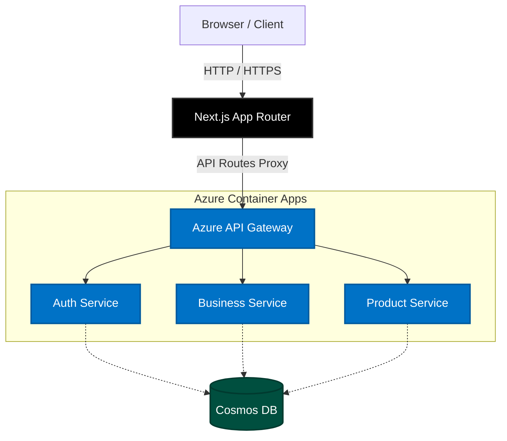

# 🛒 NexusCart Frontend

Welcome to the **NexusCart Frontend** repository! This is the modern, responsive, and high-performance client application for the NexusCart e-commerce platform.

Built with **Next.js**, **Tailwind CSS**, and **TypeScript**, this frontend delivers a seamless shopping and merchant experience with lightning-fast performance and an elegant, glassmorphic UI.

---

## 🎨 Tech Stack

- **Framework:** [Next.js 16](https://nextjs.org/) (App Router & Turbopack)
- **Styling:** [Tailwind CSS](https://tailwindcss.com/)
- **Language:** [TypeScript](https://www.typescriptlang.org/)
- **State Management:** React Hooks & Context API
- **Icons:** Custom SVG Components

---

## 🏗️ Architecture & Data Flow

The frontend acts as the primary interface for both end-customers and merchants. It communicates exclusively with the **Azure API Gateway**, which then routes requests to the appropriate backend microservices.



---

## 🚀 Getting Started

Follow these instructions to run the frontend locally.

### 1. Install Dependencies
```bash
npm install
```

### 2. Environment Configuration
Copy the example environment file to your local setup:
```bash
cp .env.example .env.local
```
Inside `.env.local`, ensure the `NEXT_PUBLIC_BACKEND_URL` is pointing to the correct backend environment (either your local API Gateway or the Azure deployment).

### 3. Run the Development Server
```bash
npm run dev
```
Open [http://localhost:3000](http://localhost:3000) with your browser to see the result.

---

## 📁 Directory Structure

```text
src/
├── app/                  # Next.js App Router pages and layouts
│   ├── api/              # API Route Handlers (Proxies to Backend)
│   ├── globals.css       # Global Tailwind and custom CSS styles
│   ├── layout.tsx        # Root layout wrapper
│   └── page.tsx          # Main landing page
└── components/           # Reusable React components
    ├── AuthModal.tsx     # Authentication and Registration UI
    ├── Header.tsx        # Navigation bar
    ├── Hero.tsx          # Landing page hero section
    └── Icons.tsx         # SVG Icon library
```

---

## 💡 Key Features
- **OTP Verification Flow:** Secure, seamless email-based sign-ups.
- **Glassmorphic UI:** Premium design aesthetics.
- **API Proxying:** Protects backend architecture by proxying requests through Next.js serverless functions.
- **Responsive Layout:** Works beautifully on desktop, tablet, and mobile.
