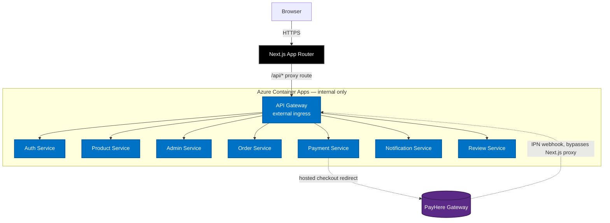

<div align="center">
  
  
  
  

  <br/>
  <h1>🛒 NexusCart Frontend</h1>
  <p><b>The customer storefront and admin console for the NexusCart e-commerce platform.</b></p>
  <p>
    
    
    
    
  </p>
</div>

---

## 🌟 Overview

This is the single Next.js application that serves both sides of NexusCart: the public storefront (browsing, cart, checkout, order history) and the admin console (products, orders, banners, promotions, users/RBAC, inventory). It talks to the backend exclusively through a catch-all API route (`src/app/api/[...path]/route.ts`) that proxies every request to the API Gateway — the browser never calls the backend directly.

---

## 💡 Feature Highlights

### Storefront
- **Templated banner & product sections** — the shop page composes banners and product rails from 7–8 configurable layouts (`carousel`, `grid`, `spotlight`, `sidebar`, `showcase`, `bento`, `marquee`, and `cinematic` for product rails), each independently positioned and orderable by an admin. One "default grid" template can even reshape the whole `/shop` catalog's column/row count.
- **Auto-advancing product carousel** — the main shop grid shows two rows at a time and rotates through the rest automatically, with hover-to-pause and touch swipe support.
- **Category directory** (`/shop/allitems`) — every category gets its own preview row with a "View all" link into the filtered, paginated grid.
- **Multi-currency** — live exchange rates, a currency switcher in the header, and prices formatted client-side everywhere (cart, checkout, invoices) without re-fetching product data.
- **Cart** — persists to `localStorage`, survives refreshes and the PayHere hosted-checkout round trip.
- **Checkout** — shipping form with a from-scratch phone input (searchable country picker with flags + calling codes, since the library's native `<select>` can't be themed), and three payment methods:
  - **Card / Digital Wallet** → redirected to **PayHere's** hosted checkout page (sandbox or live)
  - **Cash on Delivery** → order placed immediately, no gateway involved
- **Order history** (`/profile`) — paginated (3 at a time, "Load more"), with live status polling.
- **Invoices** (`/orders/[id]/invoice`) — itemized, printable, currency-aware.
- **Auth** — email/password with OTP email verification, Google OAuth one-tap login, and forgot/reset password, all backed by JWT sessions persisted to `localStorage`.

### Admin Console (`/admin`)
A single dashboard, tab-gated by per-section permissions (see the backend README for the RBAC model):
- **Products** — CRUD, categories, and a lightweight **stock in/out** modal per product (adjust quantity with a note, see the last few movements, preview the resulting stock level).
- **Orders** — status management, triggers customer notification emails.
- **Users** — admin account creation/promotion (super-admin only) and per-section permission grants (any admin can grant/narrow another admin's access, short of granting the Admin role itself).
- **Banners & Promotions** — the template builder described above, plus a discount engine (storewide, per-category, or per-product).
- **Notifications** — a live feed of pending orders, click-through to highlight them.
- **Settings** — base/supported currency configuration.

---

## 🏗️ Architecture & Data Flow



The API route proxy only forwards JSON bodies — PayHere's webhook posts form-encoded data server-to-server, so it's configured to hit the API Gateway's public URL directly instead of routing through this frontend.

---

## 🎨 Tech Stack

| Category | Library |
| :--- | :--- |
| Framework | [Next.js 16](https://nextjs.org/) (App Router, Turbopack) |
| UI | [React 19](https://react.dev/) |
| Styling | [Tailwind CSS 4](https://tailwindcss.com/) |
| Language | TypeScript 5 |
| Animation | [Framer Motion](https://www.framer.com/motion/), [Lenis](https://lenis.darkroom.engineering/) (smooth scroll) |
| Icons | [Lucide](https://lucide.dev/) |
| Toasts | [goey-toast](https://www.npmjs.com/package/goey-toast) |
| Auth | [`@react-oauth/google`](https://www.npmjs.com/package/@react-oauth/google) |
| Phone input | [`react-phone-number-input`](https://www.npmjs.com/package/react-phone-number-input) (headless, custom-styled) |
| Deployment | [Vercel](https://vercel.com/) |

---

## 📁 Directory Structure

```text
src/
├── app/
│   ├── page.tsx                     # Landing page (hero, marquee, FAQ — self-contained)
│   ├── shop/page.tsx                # Main catalog (banners + templated product rails)
│   ├── shop/allitems/page.tsx       # Category directory view
│   ├── product/[id]/page.tsx        # Product detail
│   ├── cart/page.tsx
│   ├── checkout/page.tsx            # Shipping + PayHere / Cash on Delivery
│   ├── payment/success/page.tsx     # PayHere return_url
│   ├── payment/cancel/page.tsx      # PayHere cancel_url
│   ├── auth/page.tsx                # Login / signup / OTP / forgot / reset
│   ├── profile/page.tsx             # Account + order history
│   ├── orders/[id]/invoice/page.tsx
│   ├── admin/page.tsx               # Admin console entry point
│   ├── api/[...path]/route.ts       # Catch-all proxy to the API Gateway
│   └── globals.css
├── components/
│   ├── AdminDashboard.tsx           # The full admin console (all tabs)
│   ├── AppHeader.tsx                # Nav, currency switcher, cart, auth state
│   ├── CurrencySwitcher.tsx
│   ├── Footer.tsx
│   ├── Providers.tsx                # Composes every context provider
│   ├── providers/
│   │   ├── AppStateProvider.tsx     # Session / current user
│   │   ├── CartProvider.tsx
│   │   ├── CurrencyProvider.tsx     # Exchange rates + formatPrice()
│   │   └── ToastProvider.tsx
│   └── shop/
│       └── ShopBrowser.tsx          # Banner/product template rendering engine
└── lib/
    ├── api.ts                       # apiFetch(), session helpers
    ├── flyToCart.ts                 # "add to cart" fly animation
    └── requestCache.ts              # Short-lived client cache for catalog fetches
```

---

## 🚀 Getting Started

### 1. Install dependencies
```bash
npm install
```

### 2. Configure environment
```bash
cp .env.example .env.local
```

| Variable | Purpose |
| :--- | :--- |
| `NEXT_PUBLIC_BACKEND_URL` | Base URL the `/api/*` proxy forwards to — your local API Gateway or the deployed one |
| `NEXT_PUBLIC_GOOGLE_CLIENT_ID` | Google OAuth client ID for one-tap login |

### 3. Run the dev server
```bash
npm run dev
```
Open [http://localhost:3000](http://localhost:3000). For the full experience you'll need the [backend](../backend) running too.

### 4. Build & lint
```bash
npm run build
npm run lint
```

---

## ☁️ Deployment

Deploys to **Vercel** automatically on every push to `main`. Production is aliased to a custom domain; PayHere's IPN webhook and internal service-to-service calls bypass this app entirely and talk to the backend's public API Gateway directly.

---
<div align="center">
  <i>Built with Next.js, Tailwind, and a lot of Sinhala-English debugging sessions.</i>
</div>
